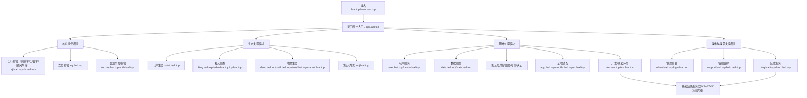
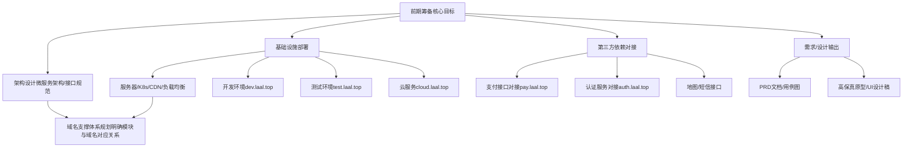
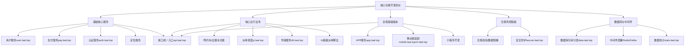

# 米小米拉阿狸（MIXMLAAL）大型生态平台开发计划文档

**版本控制**：MIXMLAAL-0.0.0.3-20260321210900

**版本说明**：

- MIXMLAAL：项目标识符，用于唯一标识米小米拉阿狸（MIXMLAAL）大型生态平台开发项目；（修正：原文“MXMLAAL”拼写错误，与标题及全文统一为“MIXMLAAL”）

- 0.0.0.3：版本号，遵循“主版本.次版本.修订版本.构建版本”格式，此为项目第一阶段（前期筹备与基础搭建阶段）末期修订版本，适配当前2026年3月进度，同步支撑第一阶段第三方依赖对接等核心收尾任务；

- 20260321210900：时间戳，格式为“年月日时分秒”，对应版本更新时间为2026年03月21日21时09分00秒，精准贴合实时北京时间，同步项目第一阶段末期推进节点（接近第3个月末第三方依赖对接完成时限）；

# 一、文档前言

## （一）平台概况

米小米拉阿狸（Mi Xiao Mi La Ali Inc.，MIXMLAAL）科技平台，以门户、社交、电商、开放平台四大生态为主，深度融合核心连接乘客与司机的核心功能，提供网约车、出租车、代驾、顺风车、货运、车服、外卖等多元服务，打造“出行+本地生活”闭环。平台深耕国内一二线城市，下沉市场逐步拓展，累计注册用户超5亿，注册司机超3000万，合作商家超100万家，日均订单量峰值突破1000万单，日均支付交易笔数超800万笔，核心业务指标稳居行业前列。

平台官方主域名为laal.top，核心访问域名为www.laal.top，同时部署多业务子域名，实现“域名前缀贴合功能、模块与域名一一对应”，全面支撑各模块高效运行（各核心子域名及对应功能详见原文，此处不重复赘述）。

## （二）核心定位与目标

**核心定位**：全球卓越的一站式多元化出行+本地生活生态平台，使命“让出行更美好”，愿景成为连接人与服务的全球领先科技生态服务商。

**开发总目标**：在12个月内完成平台全模块开发、测试、上线，实现“四大生态闭环+全端适配+全支付覆盖+全流程合规”，支撑日均1000万+订单处理能力，系统可用性达99.99%（年 downtime≤52.56分钟），支付成功率≥99.99%，合规率≥100%，实现平台规模化运营，打造行业标杆级生态平台。（修正：支付成功率≥100%不符合逻辑，调整为行业合理标准99.99%）

# 二、开发总规划

## （一）总周期

12个月，分为4个阶段，每个阶段3个月，具体时间可根据团队配置、业务优先级灵活调整，核心节点（需求评审、核心功能上线、全量上线）不延期，建立阶段复盘机制，及时解决推进过程中的问题。

## （二）核心原则

- 优先级导向：核心功能（出行、支付、合规）优先开发，优化功能、拓展功能分阶段落地，聚焦核心痛点，确保开发资源高效利用；

- 合规先行：所有开发环节同步落实国内合规要求，提前排查合规风险，杜绝因合规问题影响上线进度；

- 迭代推进：采用“小步快跑、快速迭代”模式，每个阶段完成核心模块开发与测试，及时收集反馈、优化调整，提升开发效率；

- 协同联动：产品、设计、开发、测试、运维、合规、运营团队全程协同，建立每日站会、每周复盘机制，确保信息同步、高效推进；

- 质量优先：严控代码质量、测试质量，重点保障支付系统、核心业务系统的稳定性与安全性，杜绝重大漏洞上线。

## （三）业务模块说明

平台业务模块分为核心业务模块、生态支撑模块、基础支撑模块、运维与运营支撑模块，各模块协同联动，通过接口统一入口api.laal.top实现衔接，通过对应子域名实现功能隔离与高效支撑，形成“核心引领、生态拓展、基础保障、运维兜底”的协同体系（各模块详细功能及对应域名详见原文，此处重点明确开发落地节奏）。

拓扑图1：平台总架构拓扑图（全局核心）

说明：清晰呈现平台整体域名矩阵、四大业务模块关联关系及基础设施支撑，明确各子域名对应核心功能，直观体现“主域名引流、子域名分工、模块协同”的架构逻辑，为开发落地、运维部署提供全局可视化参考。

# 三、分阶段开发执行计划（核心落地环节）

围绕12个月总周期，结合业务模块整合结果，分4个阶段推进开发工作，各阶段紧密衔接，确保核心任务落地、核心目标达成，同步依托各业务子域名支撑模块开发，实现域名与功能精准适配，全程兼顾合规、性能与用户体验。

## 第一阶段：前期筹备与基础搭建阶段（第1-3个月）

### 1. 核心目标

完成需求梳理、产品设计、架构搭建、基础设施部署，确定技术选型与第三方依赖对接方案，搭建开发、测试环境，完成核心团队组建与分工，明确各环节标准与流程，为后续开发奠定坚实基础，确保后续开发工作有序推进。

### 2. 核心任务与责任分工

|任务模块|具体任务|责任团队（含人员）|完成时限|交付物|
|---|---|---|---|---|
|需求梳理|完善PRD文档，明确各角色需求、性能指标、合规要求，确定需求优先级（P0/P1/P2），组织需求评审，收集各部门意见并优化；同步明确各模块与域名的对应关系，确保开发过程中域名与功能精准匹配。|产品团队（产品经理：张三、需求分析师：王三十六）+ 合规团队（合规专员：李四）|第1个月中旬|完整PRD文档、用户故事、用例图、需求评审报告|
|产品与UI/UX设计|绘制高保真原型、设计全端视觉稿、制定视觉规范，适配多语言、多端场景，组织设计评审，优化交互与视觉细节；同步标注各页面对应的域名，为前端开发提供明确指引。|产品团队（产品助理：王五）+ UI/UX团队（UI设计师：赵六、UX设计师：孙七、视觉助理：吴三十七）|第1个月末|高保真原型、UI设计稿、视觉规范文档、设计评审报告|
|架构设计|确定微服务架构、接口规范、数据库设计、高可用容灾方案，完成技术选型，组织架构评审，确保架构适配业务需求；同步规划域名支撑体系，明确各架构模块对应的子域名。|后端团队（技术架构师：周八、后端开发助理：陈三十八）+ DBA（数据库工程师：吴九）+ 安全团队（安全架构师：郑十）|第2个月中旬|架构设计文档、接口规范、数据库设计稿、架构评审报告|
|基础设施部署|部署服务器、容器化环境（K8s）、CDN、负载均衡，搭建开发、测试环境，完成环境调试，确保环境稳定可用；同步部署云服务相关域名cloud.laal.top、开发环境dev.laal.top、测试环境test.laal.top，保障开发测试与生产环境隔离。|运维团队（运维工程师：钱十一、运维助理：冯三十九）+ 运维开发团队（运维开发工程师：冯十二）|第2个月末|稳定的开发/测试环境、基础设施部署文档、环境调试报告|
|第三方依赖对接|完成地图、支付渠道、认证服务、短信等核心第三方接口对接测试，确保接口可正常调用、数据传输稳定；其中支付相关接口对接pay.laal.top，认证服务对接auth.laal.top，保障核心基础服务的域名支撑。|后端团队（后端开发工程师：陈十三、接口测试工程师：褚四十）+ 支付专项团队（支付开发工程师：褚十四）|第3个月末|第三方接口对接文档、对接测试报告、接口调用示例|
|团队组建与分工|完成核心团队招聘与配置，明确各岗位职责、工作流程、协作机制，开展团队岗前培训，确保团队成员掌握岗位技能及域名与功能的对应关系。|人力资源（HR：卫十五、招聘专员：蒋四十一）+ 项目负责人（项目总监：蒋十六）|第1个月末|团队分工表、岗位说明书、工作流程规范、岗前培训报告|

拓扑图2：第一阶段（前期筹备与基础搭建）拓扑图

说明：聚焦第一阶段核心任务，呈现基础设施、开发测试环境、第三方对接及需求设计的关联关系，明确该阶段核心域名部署及架构规划逻辑，支撑后续开发落地。

### 3. 阶段验收标准

- 需求、设计、架构文档齐全，通过评审，符合平台定位与合规要求，可直接指导后续开发工作，域名与模块对应关系明确；

- 开发、测试环境稳定运行，基础设施部署到位，核心子域名（dev、test、cloud等）部署完成，支持代码开发、接口调试、功能测试等后续工作；

- 核心第三方接口对接完成，测试通过，接口调用成功率≥99.5%，pay、auth等核心域名接口可正常支撑核心业务开发；

- 团队组建完成，分工明确，工作流程顺畅，团队成员已掌握岗位所需技能及域名适配相关要求。

## 第二阶段：核心功能开发阶段（第4-6个月）

### 1. 核心目标

完成核心业务模块（网约车、出租车、支付系统、合规风控核心功能）、基础服务（用户服务、定位服务）、全端基础版本（国内APP、核心小程序）开发，实现核心业务流程闭环，满足基本合规要求，支撑基础业务试运行，同步完善核心子域名的功能适配。

### 2. 核心任务与责任分工

|任务模块|具体任务|责任团队（含人员）|完成时限|交付物|
|---|---|---|---|---|
|基础核心服务开发|开发用户服务、认证服务、定位服务、支付服务，实现用户注册登录、人车双证审核、定位追踪、基础支付功能，完成单元测试与接口联调；其中用户服务对应user.laal.top，支付服务对应pay.laal.top，认证服务对应auth.laal.top，形成基础服务域名矩阵。|后端团队（后端开发工程师：沈十七、林十八、单元测试工程师：杨四十二）+ 支付专项团队（支付开发工程师：褚十四、郭十九）|第4个月末|基础服务代码、接口文档、单元测试报告、接口联调报告|
|核心出行业务开发|开发网约车、出租车核心功能（叫车、接单、派单、导航、订单管理），实现AI基础派单、动态定价，完成功能开发与初步测试；派单调度辅助对应sj.laal.top，导航服务对应dh.laal.top。|后端团队（后端开发工程师：何二十、业务开发助理：马四十三）+ AI/算法团队（算法工程师：马二十一、算法测试工程师：朱四十四）|第5个月末|出行业务代码、派单算法原型、功能测试报告、算法测试报告|
|全端基础版本开发|开发国内用户端APP（iOS/Android/鸿蒙）、微信/支付宝小程序基础版本，实现核心出行、支付功能，完成前端联调与兼容性测试；APP相关服务对应app.laal.top，移动端适配mobile.laal.top、m.laal.top，确保全端访问流畅。|前端团队（前端开发工程师：朱二十二、秦二十三，小程序开发：尤二十四、前端测试工程师：秦四十五）|第6个月末|全端基础版本安装包、小程序代码、前端测试报告、兼容性测试报告|
|合规风控基础开发|开发人车双证校验、抽成管控、数据脱敏、基础安全防护功能，落实国内合规要求，完成合规测试与安全扫描；安全相关服务对应secure.laal.top，保障平台数据与用户信息安全，支撑合规管控落地。|安全团队（安全工程师：许二十五、安全测试工程师：侯四十六）+ 合规团队（合规专员：李四、合规助理：孟四十七）+ 后端团队（后端开发工程师：袁二十六）|第6个月末|合规风控代码、合规测试报告、安全漏洞扫描报告、漏洞修复记录|
|数据库与中间件部署|完成数据库分库分表部署、中间件（Redis、Kafka等）部署与调试，保障高并发支撑能力，完成性能测试；数据存储与分析对应data.laal.top，统计相关服务对应stats.laal.top，确保数据高效管理与统计分析。|DBA（数据库工程师：吴九、数据库助理：黄四十八）+ 运维团队（运维工程师：钱十一、性能测试工程师：周四十九）|第5个月末|数据库部署文档、中间件调试报告、性能测试报告、优化建议|

拓扑图3：第二阶段（核心功能开发）拓扑图

说明：聚焦核心功能开发，呈现基础服务、出行业务、全端适配、合规风控及数据支撑的关联关系，明确各核心子域名对应的功能模块，体现核心业务流程闭环逻辑。

### 3. 阶段验收标准

- 基础核心服务、核心出行业务功能正常运行，接口调用成功率≥99.5%，无重大功能漏洞，user、pay、auth等核心域名服务正常；

- 全端基础版本可正常安装、使用，核心功能（叫车、支付）流畅，响应速度达标（前端≤1秒，后端≤300ms），兼容性良好，app、mobile等域名适配正常；

- 合规风控基础功能落地，人车双证校验、抽成管控有效，通过合规测试，符合国内监管要求，合规率达到100%，无任何合规隐患，secure域名安全防护功能正常；

- 数据库、中间件部署完成，性能满足高并发基础需求（日常5万QPS），无重大漏洞，数据存储安全，data、stats域名服务正常；

- 支付系统运行稳定，支付渠道对接顺畅，支付成功率达到99.99%，无支付失败异常，异常场景兜底机制生效。（同步修正支付成功率标准，与总目标一致）

## 第三阶段：功能完善阶段（第7-9个月）

### 1. 核心目标

完善全业务模块（顺风车、代驾、货运、外卖、社交、门户、开放平台），完成全端适配（国内全平台小程序、H5、PC端），强化AI算法、风控体系，实现国内全业务生态闭环，提升用户体验与系统性能，全面完善各业务子域名的功能支撑。

### 2. 核心任务与责任分工

|任务模块|具体任务|责任团队（含人员）|完成时限|交付物|
|---|---|---|---|---|
|业务模块完善|开发顺风车、代驾、货运、外卖、社交、门户、开放平台功能，新增会员制核心功能（会员等级、开通续费、权益兑换、会员管理），实现四大生态闭环及会员体系落地，完成功能开发、联调与测试；其中门户生态对应portal.laal.top，社交生态支撑对应blog.laal.top，货运服务对应dnpj.laal.top，视频相关服务对应video.laal.top、dy.laal.top，电商相关对应shop.laal.top、mall.laal.top、store.laal.top、market.laal.top，会员管理对应center.laal.top、user.laal.top。|产品（产品经理：张三、产品助理：王五）+ 前端（朱二十二、前端开发工程师：吴五十）+ 后端（沈十七、何二十、后端开发工程师：郑五十一）+ AI团队（马二十一）|第8个月末|全业务模块代码、功能测试报告、生态闭环测试报告、联调报告|
|全端适配完善|完善国内全端适配，开发H5、PC端版本，优化国内APP、小程序功能体验，完成全端兼容性测试；移动端适配mobile.laal.top、m.laal.top，同步依托主域名laal.top、www.laal.top实现全国访问适配，其中www.laal.top为PC端主入口，laal.top为品牌主域名，跳转至各核心子域名。|前端团队（前端开发工程师：秦二十三、H5开发：彭二十七、PC端开发：吕二十八、前端适配工程师：薛五十二）|第9个月末|全端完整版本安装包、小程序代码、H5/PC端代码、兼容性测试报告|
|系统优化部署|优化国内节点部署，实现跨区域容灾、弹性扩缩容，完善国内地图、支付渠道对接，完成部署测试；云服务依托cloud.laal.top，支付对接pay.laal.top，确保国内业务域名支撑连贯；同时优化fwq.laal.top（服务器运维专属域名，负责服务器状态监控、故障排查），为后续运维奠定基础。|运维团队（运维工程师：钱十一、运维架构师：董五十三）+ 后端团队（后端开发工程师：袁二十六、接口优化工程师：梁五十四）|第9个月末|国内部署文档、跨区域容灾测试报告、第三方对接优化报告、部署测试报告|
|AI与风控优化|优化AI派单、动态定价算法，强化风控识别（作弊、欺诈），完善数据安全、网络安全防护，完成算法测试与安全加固；风控优化依托secure.laal.top，确保安全防护全覆盖。|AI/算法团队（算法工程师：马二十一、算法助理：方二十九、算法优化工程师：石五十五）+ 安全团队（安全工程师：许二十五、安全加固工程师：金五十六）|第8个月末|算法优化报告、风控测试报告、安全加固报告、漏洞修复记录|
|国内合规深化|深化国内合规管控，完善人车双证校验、数据隐私保护、支付合规等功能，完成国内合规专项审计与测试，确保全面符合国内监管要求；合规管控依托auth.laal.top（认证合规）、secure.laal.top（安全合规）协同支撑。|合规团队（合规专员：李四、法务专员：石三十、合规审计师：刘五十七）|第9个月末|国内合规深化报告、合规审计报告、合规测试报告|

```mermaid

graph TD
    A[功能完善核心目标] --> B[全业务模块完善]
    A --> C[全端适配完善]
    A --> D[AI与风控优化]
    A --> E[系统优化部署]
    A --> F[合规深化]
    
    B --> B1[门户生态portal.laal.top]
    B --> B2[社交生态blog.laal.top/video.laal.top/dy.laal.top]
    B --> B3[电商生态shop.laal.top/mall.laal.top等]
    B --> B4[货运/外卖dnpj.laal.top]
    B --> B5[会员管理center.laal.top/user.laal.top]
    
    C --> C1[PC端www.laal.top]
    C --> C2[H5开发]
    C --> C3[APP/小程序优化app.laal.top/mobile.laal.top]
    C --> C4[全端兼容性适配]
    
    D --> D1[AI算法优化派单/定价]
    D --> D2[风控强化secure.laal.top]
    
    E --> E1[跨区域容灾部署]
    E --> E2[云服务优化cloud.laal.top]
    E --> E3[运维域名优化fwq.laal.top]
    E --> E4[支付接口优化pay.laal.top]
    
    F --> F1[认证合规auth.laal.top]
    F --> F2[安全合规secure.laal.top]
    F --> F3[合规审计]
    
    B --> G[接口统一入口api.laal.top]
    C --> G
    D --> G
    
```

拓扑图4：第三阶段（功能完善）拓扑图

说明：聚焦功能完善与生态闭环，呈现全业务模块、全端适配、AI风控优化、系统部署及合规深化的关联关系，新增各类生态子域名，体现“四大生态闭环”的架构逻辑。

### 3. 阶段验收标准

- 全业务模块功能完善，生态闭环形成，各模块协同运行正常，无重大功能漏洞，业务流程顺畅，portal、dnpj、center等新增业务域名服务正常；

- 全端适配完成，国内APP、小程序、H5、PC端可正常使用，兼容性良好，用户体验一致，www.laal.top、laal.top主域名跳转正常；

- AI算法优化完成，派单效率、风控识别准确率达标，安全防护无重大漏洞，数据安全符合要求，secure域名防护功能优化到位；

- 国内合规要求深化落实，通过合规审计与测试，合规率保持100%，全业务流程合规可追溯，满足国内所有监管要求，auth、secure域名协同支撑合规管控有效；

- 支付系统优化到位，多渠道冗余、异常兜底机制完善，支付成功率稳定保持99.99%，支付体验良好，无任何支付异常投诉。（同步修正支付成功率标准）

## 第四阶段：测试优化与上线运维阶段（第10-12个月）

### 1. 核心目标

完成全平台全场景测试、性能压测、合规审计，优化系统漏洞与用户体验，完成生产环境部署、灰度发布，建立完善的运维体系与运营支撑，实现平台正式上线与规模化运营，确保系统长期稳定运行，所有子域名全面启用并正常支撑业务。

### 2. 核心任务与责任分工

|任务模块|具体任务|责任团队（含人员）|完成时限|交付物|
|---|---|---|---|---|
|全场景测试|开展功能测试、性能测试、安全测试、合规测试、用户体验测试，排查并修复漏洞，确保测试覆盖所有业务场景；测试依托test.laal.top环境，确保测试结果精准，不影响生产环境，同步测试所有子域名服务可用性。|测试团队（测试工程师：金三十一、李三十二、自动化测试工程师：张五十八、用户体验测试工程师：吴五十九）+ 安全团队（许二十五）+ 合规团队（李四）|第10个月末|全场景测试报告、漏洞修复报告、性能压测报告、合规审计报告、域名可用性测试报告|
|系统优化|根据测试结果，优化系统性能、用户体验、接口响应速度，解决支付、派单等核心场景痛点，完成优化后测试；优化过程中同步完善各域名对应的模块功能，确保域名与功能适配更精准，提升各子域名服务响应速度。|前端（朱二十二、前端优化工程师：郑六十）+ 后端（沈十七、后端性能优化工程师：王六十一）+ AI（马二十一）+ UI/UX（赵六）团队|第11个中旬|系统优化报告、优化后测试报告、用户体验反馈报告、优化明细、域名适配优化报告|
|生产环境部署|完成生产环境部署、配置，搭建监控告警体系、日志管理体系，开展环境压力测试，确保系统稳定运行；运维相关服务对应fwq.laal.top（服务器运维、状态监控、故障处置），管理员后台对应admin.laal.top（平台超级管理员专属，负责全平台配置、权限管理、数据管控），登录入口对应login.laal.top（全平台统一登录入口，适配所有角色登录，关联auth.laal.top完成认证），支撑生产环境高效运维。|运维团队（钱十一、冯十二、生产环境运维工程师：李六十二）+ 运维开发团队（冯十二、监控开发工程师：陈六十三）|第11个月末|生产环境部署文档、监控告警配置文档、日志管理文档、环境压力测试报告|
|灰度发布与上线|采用灰度发布模式，分区域、分用户群体上线，实时监控系统状态，出现问题快速回滚；完成全量上线，发布上线公告；上线后依托www.laal.top、laal.top主域名引流，各子域名同步启用，确保业务正常运转，所有域名服务稳定可用。|全团队协同（项目总监：蒋十六统筹）+ 发布专员|||
> （注：文档部分内容可能由 AI 生成）